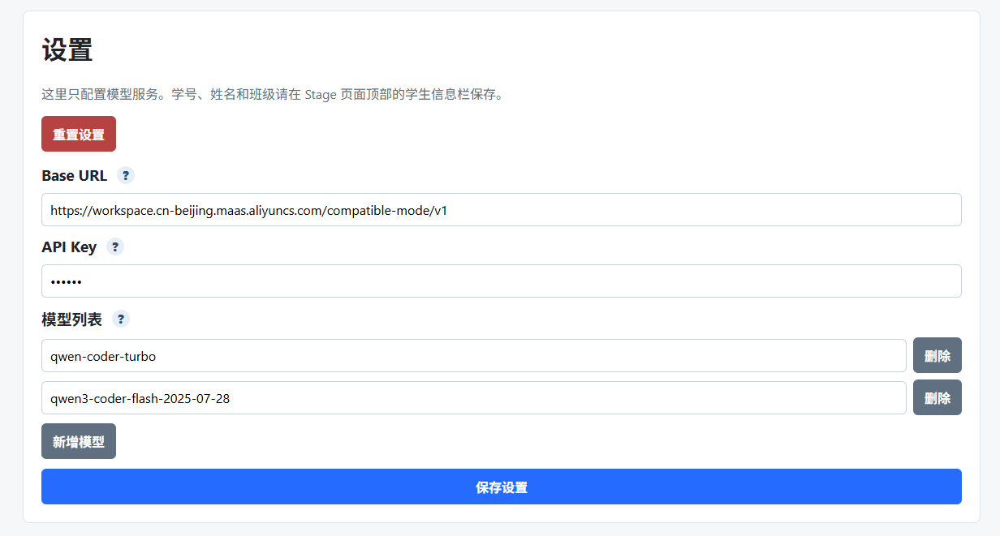
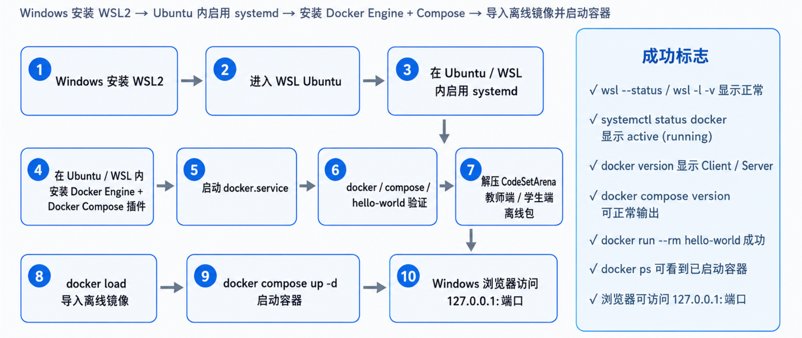
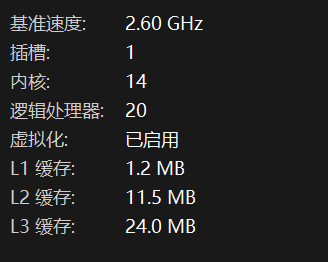
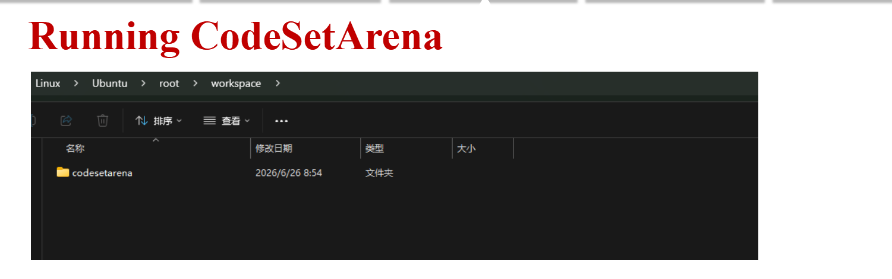

# Project-Based AI Hands-on Training

**API 调用 · WSL2 · Ubuntu 22.04 LTS · Docker Engine · Docker Compose · CodeSetArena**


# 📌 文档速览

| 模块             | 你要完成什么                                         | 成功标志                                         |
| ---------------- | ---------------------------------------------------- | ------------------------------------------------ |
| 🧭 API 调用       | 登录阿里云百炼，查看额度，创建 API Key，确认 BaseURL | 拿到模型名、额度、BaseURL                        |
| 🐧 WSL Ubuntu     | 在 Windows 上安装 WSL2 + Ubuntu 22.04 LTS            | `wsl -l -v` 显示 `VERSION 2`                     |
| 👑 root + systemd | 以 root 进入 Ubuntu，并启用 systemd                  | `whoami=root`，`ps -p 1 -o comm=` 输出 `systemd` |
| 🐳 Docker Engine  | 在 WSL Ubuntu 内安装 Docker，不走 Docker Desktop     | `docker version` 显示 Client / Server            |
| 🧩 Docker Compose | 安装并验证 Compose                                   | `docker compose version` 正常输出                |
| 🏟️ CodeSetArena   | 复制离线包、解压、导入镜像、启动服务                 | `docker compose ps` 显示 `Up`                    |
| 🌐 浏览器访问     | Windows 浏览器打开本地服务                           | `http://127.0.0.1:8000` 可访问                   |

# 🧭 推荐阅读顺序

1. **API 调用**：先确认阿里云百炼登录、额度、API Key 和 BaseURL。  
2. **WSL Ubuntu**：安装 Windows + WSL2 + Ubuntu 22.04 LTS。  
3. **root + systemd**：设置专用 Docker / CodeSetArena 环境。  
4. **Docker Engine & Compose**：选择 Docker 官方源或 Ubuntu 仓库路线。  
5. **CodeSetArena 本地部署**：从 `/mnt/f/...` 复制安装包，导入镜像并启动。  
6. **快速启动**：以后只需要进入目录并执行 `docker compose start` 或 `docker compose up -d`。


# API 配置


## 获取 API Key

1. 登录 [阿里云大学](https://university.aliyun.com/)
2. 进入 [百炼控制台](https://bailian.console.aliyun.com/) 获取免费配额
3. 在 API Key 管理页面创建密钥

业务空间 ID决定了你的BaseURL格式

你已经创建的是 **华北 2（北京）的百炼按量计费 API Key**，那么你的 OpenAI 兼容 BaseURL 格式就是：

```
https://{WorkspaceId}.cn-beijing.maas.aliyuncs.com/compatible-mode/v1
```

把 `{WorkspaceId}` 替换成你的真实 **业务空间 ID** 即可。阿里云官方文档明确说明，华北 2（北京）的按量计费 Base URL 是这个格式，且需要用真实业务空间 ID 替换 `WorkspaceId`。

## **如何找到你的 WorkspaceId**

进入 **阿里云百炼控制台**，确认右上角地域是 **华北 2（北京）**，然后进入 **业务空间管理**，在列表里的 **Workspace ID** 列复制你 API Key 所属业务空间的 ID。官方文档说明：登录百炼控制台后，进入业务空间管理界面，在 `Workspace ID` 列查看并复制对应业务空间 ID。

也就是说，假设你的 Workspace ID 是：llm-abc123

那么你的 BaseURL 就是：https://llm-abc123.cn-beijing.maas.aliyuncs.com/compatible-mode/v1

BaseURL ：https://{WorkspaceId}.cn-beijing.maas.aliyuncs.com/compatible-mode/v1

| 模型                | 当前剩余额度            |
| ------------------- | ----------------------- |
| `qwen3.6-flash`     | **999,958 / 1,000,000** |
| `qwen3.7-plus`      | 1,000,000 / 1,000,000   |
| `deepseek-v4-flash` | 1,000,000 / 1,000,000   |

注意：这是 **免费额度**，不是账户现金余额。阿里云官方说明，百炼会给各模型发放新人免费额度，免费额度仅用于抵扣模型实时推理调用；额度到期或耗尽后，继续调用会产生计费。([阿里云帮助中心](https://help.aliyun.com/zh/model-studio/new-free-quota?utm_source=chatgpt.com))

系统抵扣顺序一般是 **免费额度优先**，免费额度用完后才会开始抵扣资源包或产生按量费用。([阿里云帮助中心](https://help.aliyun.com/zh/model-studio/savings-plan-and-resource-package?utm_source=chatgpt.com))



<div style="text-align: center;">
🐧 ━━━━━━ Linux / WSL ━━━━━━ 🐧
</div>




Windows 安装 WSL2 → 在线安装 Ubuntu → 在 Ubuntu / WSL 内启用 systemd → 在线安装 Docker Engine + Docker Compose 插件 → 导入离线镜像 → 解压项目包 → 使用 Docker Compose 启动容器 → Windows 浏览器访问本地端口。

本手册采用“在 WSL Ubuntu 内安装 Docker Engine”的方式，不依赖 Docker Desktop。Microsoft 官方文档说明，`wsl --install` 可一键安装 WSL 并默认安装 Ubuntu，新安装的 Linux 发行版默认使用 WSL 2；Docker 官方文档推荐在 Ubuntu 中通过 Docker 的 apt 仓库安装 Docker Engine 与 `docker-compose-plugin`。

<div style="text-align: center;">
🐧 ━━━━━━ WSL Ubuntu ━━━━━━ 🐧
</div>


下面是**只安装 WSL2 + Ubuntu 22.04 LTS** 的完整流程。

这一步是在后续 Docker Engine / CodeSetArena 之前完成的基础环境；

强调：wsl 命令一般在 Windows PowerShell 执行，

`apt`、`systemctl`、`docker` 等命令才是在 WSL Ubuntu 终端中执行 。

# 第一步. 前提确认

适用系统：**Windows 11** 或 **Windows 10 版本 2004 及以上，Build 19041 及以上**。Microsoft 官方 WSL 安装文档说明，下面的 `wsl --install` 命令要求 Windows 10 version 2004+ / Build 19041+ 或 Windows 11。([Microsoft Learn](https://learn.microsoft.com/en-us/windows/wsl/install))

建议先确认虚拟化已开启：

1. 打开任务管理器。

2. 进入 **性能 → CPU**。

3. 看右下角 **虚拟化** 是否为 **已启用**。

   

Ubuntu 官方 WSL 文档也提醒：WSL 需要启用虚拟化，`wsl --install` 会尝试启用 Virtual Machine Platform，但通常需要重启后生效。([Ubuntu Documentation](https://documentation.ubuntu.com/wsl/stable/howto/install-ubuntu-wsl2/))

------

## 打开 Windows PowerShell 管理员模式

在 Windows 开始菜单搜索：

```bash
PowerShell
```

右键选择：

```text
以管理员身份运行
```

后面的 `wsl ...` 命令都在这个 **Windows PowerShell 管理员窗口** 里执行。

------

## 更新 WSL 

先执行：

```bash
wsl --update
```

再查看 WSL 版本：

```bash
wsl --version
```

Microsoft WSL 基础命令文档说明，`wsl --update` 用于更新 WSL，`wsl --version` 用于查看 WSL 及其组件版本。([Microsoft Learn](https://learn.microsoft.com/en-us/windows/wsl/basic-commands))

## 查看可安装的 Ubuntu 版本

执行：

```bash
wsl --list --online
```

也可以写成：

```bash
wsl -l -o
```

你要找的是：

```bash
Ubuntu-22.04    Ubuntu 22.04 LTS
```

Ubuntu 官方 WSL 文档示例中，可安装列表包含 `Ubuntu-22.04 Ubuntu 22.04 LTS`，并说明可以用列表里的 `NAME` 安装指定版本。([Ubuntu Documentation](https://documentation.ubuntu.com/wsl/stable/howto/install-ubuntu-wsl2/))

用管理员 PowerShell 执行：

```bash
ipconfig /flushdns
netsh winsock reset
netsh winhttp reset proxy
```

执行完后重启电脑，再试：

```bash
wsl --list --online
```

------

## 安装 Ubuntu 22.04 LTS

执行：

```powershell
wsl --install -d Ubuntu-22.04
```

如果你的 Windows / WSL 使用的是新版语法，也可能支持：

```powershell
wsl --install Ubuntu-22.04
```

我建议用第一种，兼容性更好：

```powershell
wsl --install -d Ubuntu-22.04
```

Microsoft 官方文档说明，`wsl --install -d <Distro>` 可以指定要安装的 Linux 发行版；如果没指定，默认会安装 Ubuntu。([Microsoft Learn](https://learn.microsoft.com/en-us/windows/wsl/install))

如果下载卡在 0% 或 Microsoft Store 下载异常，试试：

```powershell
wsl --install --web-download -d Ubuntu-22.04
```

Microsoft 文档也给出过这个处理方式：如果安装卡在 0.0%，可以加 `--web-download -d <DistroName>`。([Microsoft Learn](https://learn.microsoft.com/en-us/windows/wsl/install))

------

## 重启 Windows

安装完成后，按提示重启电脑。

重启后，再打开 PowerShell，执行：

```bash
wsl -l -v
```

出现类似：

```bash
  NAME            STATE           VERSION
* Ubuntu-22.04    Stopped         2
```

Microsoft 文档说明，可以用 `wsl --list --verbose` / `wsl -l -v` 查看已安装发行版及其 WSL 版本。([Microsoft Learn](https://learn.microsoft.com/en-us/windows/wsl/basic-commands))

------

## 如果 Ubuntu-22.04 不是 VERSION 2，改成 WSL2

如果你看到：

```text
Ubuntu-22.04    Stopped    1
```

执行：

```powershell
wsl --set-version Ubuntu-22.04 2
```

并把以后新装的发行版默认设为 WSL2：

```powershell
wsl --set-default-version 2
```

Microsoft 文档说明，`wsl --set-version <distribution name> <versionNumber>` 可以把某个发行版设置为 WSL 1 或 WSL 2，`wsl --set-default-version 2` 可以把新发行版默认设为 WSL2。([Microsoft Learn](https://learn.microsoft.com/en-us/windows/wsl/basic-commands))

------

### 7. 设置默认 Ubuntu 发行版

如果你只装了一个 Ubuntu，可以跳过。

如果你电脑里有多个 WSL 发行版，建议设定默认版本：

```powershell
wsl --set-default Ubuntu-22.04
```

以后直接输入：

```powershell
wsl
```

就会进入 Ubuntu 22.04。

Microsoft 文档说明，`wsl --set-default <Distribution Name>` 可以设置默认 WSL 发行版。([Microsoft Learn](https://learn.microsoft.com/en-us/windows/wsl/basic-commands))

------

# 第二步. Ubuntu 

## 第一次进入 Ubuntu 22.04

执行：

```bash
wsl -d Ubuntu-22.04
```

或者从开始菜单搜索：

```bash
Ubuntu 22.04
```

第一次启动时，Ubuntu 会让你创建 Linux 用户名和密码。Microsoft 文档说明，首次启动新安装的 Linux 发行版时，会解压文件并要求创建用户账户和密码。([Microsoft Learn](https://learn.microsoft.com/en-us/windows/wsl/install))

例如：

```bash
Enter new UNIX username: yxs
New password:
Retype new password:
```

注意：输入密码时屏幕不会显示字符，这是正常的。

------

## 用 root 进入 Ubuntu

在 **PowerShell** 执行：

```bash
wsl -d Ubuntu-22.04 -u root
```

进入后执行：

```bash
whoami
```

应该输出：

```bash
root
```

Microsoft 文档说明，可以用 `wsl --distribution <Distribution Name> --user <User Name>` 指定发行版和用户进入，例如指定 `root`；如果用户不存在才会报错，而 `root` 是 Linux 里默认存在的用户。

------

## 把这个 WSL 设置成默认 root + systemd

在 root 里面执行：

```bash
cat > /etc/wsl.conf <<'EOF'
[boot]
systemd=true

[user]
default=root
EOF

cat /etc/wsl.conf
```

Microsoft 的 WSL 配置文档说明，`/etc/wsl.conf` 是每个发行版自己的配置文件，可以配置 systemd 和默认用户；`[user] default=...` 用来指定 WSL 会话启动时使用哪个用户 。Docker 专用入口也正是用 `-u root` 进入 `/root/workspace` 并启动 Docker 服务

------

## 把这个 WSL 设置成默认 root + systemd

### 进入 Ubuntu 后做基础更新

进入 Ubuntu 终端后，执行：

```bash
sudo apt update
sudo apt upgrade -y
```

再装一些常用工具：

```bash
sudo apt install -y curl wget git vim nano unzip ca-certificates gnupg lsb-release
```

确认 Ubuntu 版本：

```bash
cat /etc/os-release
```

你应该能看到类似：

```bash
VERSION="22.04.x LTS (Jammy Jellyfish)"
```

------

### 为后续 Docker Engine 做准备：启用 systemd

CodeSetArena Student平台**并不依赖 Docker Desktop，在 WSL Ubuntu 内安装 Docker Engine**，所以建议现在就启用 `systemd`。文档第二部分也明确说，目标是在 WSL 内安装 Docker Engine 与 Compose 插件，而不是 Docker Desktop 。

先在 Ubuntu 里检查：

```bash
ps -p 1 -o comm
```

如果输出已经是：

```text
systemd
```

这一步可以跳过。

如果不是，执行：

```bash
sudo tee /etc/wsl.conf > /dev/null <<'EOF'
[boot]
systemd=true
EOF
```

然后退出 Ubuntu：

```bash
exit
```

回到 **Windows PowerShell**，执行：

```powershell
wsl --shutdown
wsl -d Ubuntu-22.04/wsl -d Ubuntu
```

再检查：

```bash
ps -p 1 -o comm=
```

Microsoft WSL 配置文档说明，启用 systemd 需要在 `/etc/wsl.conf` 中加入 `[boot] systemd=true`，然后从 PowerShell 执行 `wsl.exe --shutdown` 重启 WSL 实例。([Microsoft Learn](https://learn.microsoft.com/en-us/windows/wsl/wsl-config))

------

# 第三步.检查最终状态

在 PowerShell 执行：

```bash
wsl -l -v
wsl --status
```

期望：

```bash
Ubuntu-22.04    Running 或 Stopped    2
```

进入 Ubuntu：

```bash
wsl -d Ubuntu-22.04
```

在 Ubuntu 里执行：

```bash
whoami
pwd
cat /etc/os-release
ps -p 1 -o comm=
```

理想结果：

```bash
Ubuntu 22.04.x LTS
systemd
```

------


# 第四步.最小完整版总结

在 **PowerShell 管理员模式**执行：

```powershell
wsl --update
wsl --list --online
wsl --install -d Ubuntu-22.04
```

重启 Windows 后：

```powershell
wsl -l -v
wsl --set-version Ubuntu-22.04 2
wsl --set-default Ubuntu-22.04
wsl -d Ubuntu-22.04
```

进入 Ubuntu 后：

```bash
sudo apt update
sudo apt upgrade -y
sudo apt install -y curl wget git vim nano unzip ca-certificates gnupg lsb-release

cat /etc/os-release
```

为后续 Docker Engine 启用 systemd：

```bash
sudo tee /etc/wsl.conf > /dev/null <<'EOF'
[boot]
systemd=true
EOF

exit
```

回到 PowerShell：

```powershell
wsl --shutdown
wsl -d Ubuntu-22.04
```

再在 Ubuntu 里确认：

```bash
ps -p 1 -o comm=
```

看到：

```text
systemd
```

就说明 **Windows + WSL2 + Ubuntu 22.04 LTS** 基础环境完成。下一步才是在 Ubuntu 里安装 Docker Engine。

<div style="text-align: center;">
🐳 ━━━━━━ Docker Engine & Docker Compose ━━━━━━ 🐳
</div>

Docker 官方 Ubuntu 安装文档也是先配置 Docker apt 仓库，再安装 `docker-ce docker-ce-cli containerd.io docker-buildx-plugin docker-compose-plugin`。([Docker Documentation](https://docs.docker.com/engine/install/ubuntu/))

## 先确认当前状态

在 Ubuntu 里执行：

```bash
whoami
ps -p 1 -o comm=
cat /etc/os-release
```

理想结果类似：

```text
root
systemd
Ubuntu 22.04.x LTS
```

------

## 清理可能存在的旧 Docker 包

```bash
for pkg in docker.io docker-doc docker-compose docker-compose-v2 \
  podman-docker containerd runc; do
  apt-get remove -y $pkg
done
```

------

## 更新 apt，并安装基础依赖

```bash
apt-get update

apt-get install -y ca-certificates curl gnupg
```

------

## 第二步. 走官方源/Ubuntu仓库

### 策略一：Docker官方镜像源安装🐳 

#### 添加 Docker 官方 GPG key

```bash
install -m 0755 -d /etc/apt/keyrings

curl -fsSL https://download.docker.com/linux/ubuntu/gpg \
  -o /etc/apt/keyrings/docker.asc

chmod a+r /etc/apt/keyrings/docker.asc
```

------

#### 添加 Docker 官方 apt 源

```bash
cat > /etc/apt/sources.list.d/docker.sources <<EOF
Types: deb
URIs: https://download.docker.com/linux/ubuntu
Suites: $(. /etc/os-release && echo "${UBUNTU_CODENAME:-$VERSION_CODENAME}")
Components: stable
Architectures: $(dpkg --print-architecture)
Signed-By: /etc/apt/keyrings/docker.asc
EOF

apt-get update
```

这一步对应你文档里的 Docker 官方仓库安装流程，核心就是写入 `/etc/apt/sources.list.d/docker.sources`，然后 `apt-get update` 。

------

#### 安装 Docker Engine + Compose 插件

```bash
apt-get install -y docker-ce docker-ce-cli containerd.io \
  docker-buildx-plugin docker-compose-plugin
```

Docker 官方文档给出的最新版本安装包名也是这一组：`docker-ce docker-ce-cli containerd.io docker-buildx-plugin docker-compose-plugin`。([Docker Documentation](https://docs.docker.com/engine/install/ubuntu/))

------

#### 启动 Docker 服务并设置开机启动

```bash
systemctl enable --now docker

systemctl status docker --no-pager
```

看到类似：

```text
active (running)
```

就说明 Docker daemon 已启动。Docker 官方文档也说明安装后应检查 `systemctl status docker`，如果没运行就用 `systemctl start docker` 启动。([Docker Documentation](https://docs.docker.com/engine/install/ubuntu/))

------

#### 验证 Docker 和 Compose

```bash
docker version
docker compose version
docker ps
docker run --rm hello-world
```

你文档里的验证项也是：`docker version` 同时看到 Client 和 Server，`docker compose version` 能输出版本号，`docker ps` 正常显示表头，`hello-world` 输出成功信息 。Docker 官方也推荐用 `docker run hello-world` 验证安装成功。([Docker Documentation](https://docs.docker.com/engine/install/ubuntu/))

------

#### 总结：可执行版脚本

```bash
whoami
ps -p 1 -o comm=
cat /etc/os-release

for pkg in docker.io docker-doc docker-compose docker-compose-v2 \
  podman-docker containerd runc; do
  apt-get remove -y $pkg
done

apt-get update
apt-get install -y ca-certificates curl gnupg

install -m 0755 -d /etc/apt/keyrings

curl -fsSL https://download.docker.com/linux/ubuntu/gpg \
  -o /etc/apt/keyrings/docker.asc

chmod a+r /etc/apt/keyrings/docker.asc

cat > /etc/apt/sources.list.d/docker.sources <<EOF
Types: deb
URIs: https://download.docker.com/linux/ubuntu
Suites: $(. /etc/os-release && echo "${UBUNTU_CODENAME:-$VERSION_CODENAME}")
Components: stable
Architectures: $(dpkg --print-architecture)
Signed-By: /etc/apt/keyrings/docker.asc
EOF

apt-get update

apt-get install -y docker-ce docker-ce-cli containerd.io \
  docker-buildx-plugin docker-compose-plugin

systemctl enable --now docker

systemctl status docker --no-pager

docker version
docker compose version
docker ps
docker run --rm hello-world
```

### 策略二：使用 Ubuntu 仓库安装 Docker🐳 

你现在要走的是 **Ubuntu 仓库版 Docker**，不添加 Docker 官方源，也不写 `/etc/apt/sources.list.d/docker.sources`。

Ubuntu 官方包页面也显示 Ubuntu 22.04 Jammy 仓库里有 `docker.io` 包，属于 `universe` 组件。([Ubuntu 软件包搜索](https://packages.ubuntu.com/jammy/docker.io))

先执行这一整段：

```bash
# 1. 如果之前添加过 Docker 官方源，先删除，避免混用
rm -f /etc/apt/sources.list.d/docker.list
rm -f /etc/apt/sources.list.d/docker.sources
rm -f /etc/apt/keyrings/docker.asc
rm -f /etc/apt/keyrings/docker.gpg

# 2. 清理 apt 缓存并更新
apt-get clean
apt-get update

# 3. 确保 universe 仓库可用
apt-get install -y software-properties-common
add-apt-repository -y universe

# 4. 再更新一次
apt-get update

# 5. 查看 Ubuntu 仓库里 Docker 包是否可用
apt-cache policy docker.io docker-compose-v2 docker-compose

# 6. 使用 Ubuntu 仓库安装 Docker 和 Compose v2
apt-get install -y docker.io docker-compose-v2

# 7. 启动 Docker 服务
systemctl enable --now docker

# 8. 验证
systemctl status docker --no-pager
docker version
docker compose version
docker ps
```

Docker 官方文档也提醒，`docker.io`、`docker-compose`、`docker-compose-v2` 这类包是 Linux 发行版提供的包，和 Docker 官方源里的 `docker-ce` 等包不要混装；所以你现在选择 Ubuntu 仓库路线，就不要再同时保留 Docker 官方 apt 源。([docs.docker.com](https://docs.docker.com/engine/install/ubuntu/))

# 🐳 CodeSetArena 学生端本地部署教程 🐳

## 路径映射（Windows ↔ WSL）

你的后续安装包在 Windows 里类似：

```text
F:\Ubuntu\DUT_IR\Codesetarena\...
```

在 Ubuntu 里要写成：

```bash
/mnt/f/Ubuntu/DUT_IR/Codesetarena/...
```

Microsoft WSL 配置文档说明，Windows 固定盘默认会挂载到 `/mnt/` 下，例如 `C:\` 会挂载为 `/mnt/c/`。([Microsoft Learn](https://learn.microsoft.com/en-us/windows/wsl/wsl-config))

| Windows 路径                        | WSL Ubuntu 路径                         |
| ----------------------------------- | --------------------------------------- |
| `F:\Ubuntu\DUT_IR\Codesetarena\...` | `/mnt/f/Ubuntu/DUT_IR/Codesetarena/...` |
| `C:\Users\xxx`                      | `/mnt/c/Users/xxx`                      |

## **检查架构，应该看到 x86_64 和 arch=amd64**

```ba
uname -m
docker image inspect codesetarena-student:v7.1.3 \
--format 'image os={{.Os}} arch={{.Architecture}} variant={{.Variant}}'
```

## 第二步. 配置学生端镜像

### 📦 进入学生端目录

```bash
cd ~/workspace/codesetarena-teacher-local-v7.1.3-linux-amd64
```



## 🐳 导入 CodeSetArena 离线镜像

> ✅ **Running CodeSetArena**
>
> **1. 设置 amd64 包路径(arm64)**
>
> STUDENT_PKG="/mnt/f/Ubuntu/DUT_IR/Codesetarena/codesetarena-student-local-v7.1.3-linux-amd64.tar.gz"
>
> **2. 确认包存在**
>
> ls -lh "$STUDENT_PKG"
>
> **3. 复制 amd64 包并解压**
>
> cp "$STUDENT_PKG" .
> tar -xzf codesetarena-student-local-v7.1.3-linux-amd64.tar.gz
>
> **4. 进入 amd64 学生端目录**
>
> cd codesetarena-student-local-v7.1.3-linux-amd64
>
> **5. 载入 amd64 镜像 🐳导入 Docker 离线镜像**
>
> docker load -i codesetarena-student-v7.1.3.image.tar
>
> **6. 启动**
>
> docker compose up -d
>
> docker compose ps
>
> **7. 查看状态**
>
> docker compose ps

------

## ⚙️  学生端快速启动

快速启动分两种情况：**你只是关机 / 重启 WSL / 容器停了**，用 `docker compose start`；**你之前执行过 `docker compose down`**，用 `docker compose up -d`。

进入 WSL 后执行：

```bash
systemctl start docker.service

cd /root/workspace/codesetarena/student/codesetarena-student-local-v7.1.3-linux-amd64

docker compose start
docker compose ps
```

然后浏览器访问：

```text
http://127.0.0.1:8000
```

`docker compose start` 的作用是启动已经存在的 Compose 容器；Docker 官方文档说明它用于 “Starts existing containers for a service”。([Docker Documentation](https://docs.docker.com/reference/cli/docker/compose/start/?utm_source=chatgpt.com))🌐 **http://127.0.0.1:8000**


**如果 `docker compose start` 没启动成功**

说明容器可能被你之前 `docker compose down` 删除过。这时用：

```bash
docker compose up -d
docker compose ps
```

`docker compose up` 会创建并启动服务；官方文档说明它会 build / recreate / start 容器，`-d` 是后台运行。([Docker Documentation](https://docs.docker.com/reference/cli/docker/compose/up/?utm_source=chatgpt.com))


# 🧯 常见问题速查

**Q1：`docker compose` 不存在怎么办？**

先试：

```bash
docker-compose version
```

如果这个能输出版本，说明你安装的是旧版 Compose v1。启动时改用：

```bash
docker-compose up -d
```

---

**Q2：Docker 服务没有启动怎么办？**

```bash
systemctl start docker.service
systemctl status docker --no-pager
```

---


**Q3：端口 8000 被占用怎么办？**

查看占用情况：

```bash
docker ps -a --format 'table {{.ID}}\t{{.Names}}\t{{.Image}}\t{{.Ports}}\t{{.Status}}'
```

如果是旧容器占用，可以进入对应目录执行：

```bash
docker compose down
```

再启动：

```bash
docker compose up -d
```

---

**Q4：如何确认当前 Docker 来源？**

```bash
apt-cache policy docker.io docker-ce docker-compose-v2 docker-compose-plugin

dpkg -l | grep -E 'docker|containerd|compose'
```

判断规则：

| 包名                    | 说明                       |
| ----------------------- | -------------------------- |
| `docker.io`             | Ubuntu 仓库版 Docker       |
| `docker-ce`             | Docker 官方源版 Docker     |
| `docker-compose-v2`     | Ubuntu 仓库版 Compose v2   |
| `docker-compose-plugin` | Docker 官方源版 Compose v2 |

---

# **✅ 最终验收清单**

| 检查项       | 命令                      | 期望结果                         |
| ------------ | ------------------------- | -------------------------------- |
| WSL 版本     | `wsl -l -v`               | Ubuntu-22.04 是 VERSION 2        |
| 默认用户     | `whoami`                  | `root`                           |
| systemd      | `ps -p 1 -o comm=`        | `systemd`                        |
| Docker 服务  | `systemctl status docker` | `active (running)`               |
| Docker 版本  | `docker version`          | Client / Server 都有输出         |
| Compose 版本 | `docker compose version`  | 输出版本号                       |
| 容器状态     | `docker compose ps`       | `Up`                             |
| 服务访问     | 浏览器访问                | `http://127.0.0.1:8000` 正常打开 |

---

# 📚 官方参考链接

| 资源                     | 链接                                                         |
| ------------------------ | ------------------------------------------------------------ |
| Microsoft WSL 安装       | https://learn.microsoft.com/en-us/windows/wsl/install        |
| Microsoft WSL 基础命令   | https://learn.microsoft.com/en-us/windows/wsl/basic-commands |
| WSL systemd 配置         | https://learn.microsoft.com/en-us/windows/wsl/systemd        |
| Docker Engine on Ubuntu  | https://docs.docker.com/engine/install/ubuntu/               |
| Docker Compose 安装      | https://docs.docker.com/compose/install/                     |
| Docker Compose up        | https://docs.docker.com/reference/cli/docker/compose/up/     |
| Docker Compose start     | https://docs.docker.com/reference/cli/docker/compose/start/  |
| Docker image load        | https://docs.docker.com/reference/cli/docker/image/load/     |
| Model Studio OpenAI 兼容 | https://www.alibabacloud.com/help/en/model-studio/compatibility-of-openai-with-dashscope |

---

> **总结：** 本文档完整介绍了从零开始在 Windows 上通过 WSL2 + Ubuntu 22.04 LTS 搭建 Docker 环境，进而部署 CodeSetArena AI 实训平台的流程，面向学生/学员使用场景，v7.1.3 版本。
