# CodeSetArena Student系统使用


# Stage1 Task

## 一、Stage 1 目标

Stage 1 的任务是编写并提交 **5 道有效编程题目**。有效题目需要满足两个条件：第一，题目本身能够被参考答案正确校验；第二，在题目详情页中，至少选择 1 条、最多选择 5 条当前有效的模型运行记录。系统导出的 Stage 1 包会自动携带学号、姓名、班级、题目信息和已选择的有效运行记录。

编程题目建议至少包含：题目描述、输入格式、输出格式、数据范围、样例输入、样例输出、参考答案和测试用例。在线评测类编程题通常会使用样例数据帮助理解题意，同时使用额外测试数据检查边界情况和隐藏错误。

------

## 二、进入 Stage 1 原始题目页面

打开系统后，进入 **“Stage 1 原始题目”** 页面。页面顶部会显示当前 Stage 的任务说明：

> 请选择 5 道有效题目。有效题目需要参考答案校验通过，并已在详情页选择 1-5 条有效运行记录。导入包会自动同步这里的信息；所有导出包都会带上学号、姓名和班级。

在正式开始前，需要确认当前页面处于 Stage 1，并检查页面中是否已有旧题目或旧导入包。

------

## 三、清空当前 Stage 或导入已有题目包

###  3.1 清空当前 Stage

如果当前页面已有旧题目、旧运行记录或旧导入包，点击：

```
清空当前 Stage
```

清空后，当前 Stage 的题目列表和导入包信息会被重置。建议在重新制作 Stage 1 前先清空，避免新旧题目混在一起。

### 3.2 导入之前导出的题目包

如果之前已经导出过 Stage 1 包，可以点击：

```
选择文件
```

选择文件名类似下面格式的压缩包：

```
1001-student-stage1-problems.tar.gz
```

然后点击：

```
导入 Stage 1 原始题目包
```

导入后，系统会自动同步学生信息，并替换当前题目列表。题目包本质上用于分发和保存编程题目、测试数据及相关评测信息；类似的编程竞赛题目包也常用于算法竞赛和教学场景。

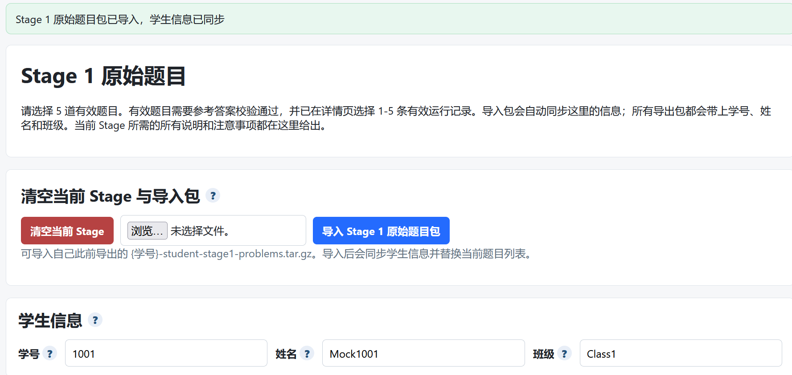


### 3.2 导入之前导出的题目包

如果学生之前已经使用系统完成过题目创建，并且导出过 Stage 1 原始题目包，则可以在本步骤中导入之前导出的题目包，继续查看、修改或重新打包题目。题目包文件通常为：

```
{学号}-student-stage1-problems.tar.gz
```

导入前需要确认该文件是从本系统导出的原始题目包，且文件名、文件格式没有被随意修改。导入成功后，系统会在“题目列表”中显示已导入的题目，学生可以继续检查题目内容、修改题面、调整测试数据，并重新选择需要打包导出的 5 道有效题目。

需要特别注意的是：第一次使用系统的学生通常没有之前导出的题目包。此时不需要执行“导入题目包”操作，而应先点击页面右上角的“新建题目”按钮，依次创建题目。系统要求导出前必须选择 5 道有效题目，因此学生至少需要新建并完善 5 道题目，确保每道题都包含完整题面、函数签名、参考答案、样例数据和测试数据。

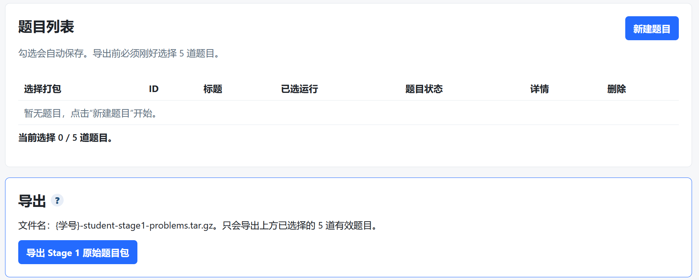

当题目创建完成后，学生需要在“题目列表”中勾选需要提交的 5 道题目。页面下方会显示当前选择数量，例如“当前选择 0 / 5 道题目”。只有当选择数量达到 5 / 5，并且所选题目均为有效题目时，才能正常导出 Stage 1 原始题目包。

如果页面显示“暂无题目，点击‘新建题目’开始”，说明当前账号下还没有创建任何题目。此时应先完成以下操作：

1. 点击“新建题目”；

2. 按要求填写题面、函数签名、参考答案、样例数据和测试数据；

3. 保存题目后返回题目列表；

4. 重复上述步骤，直到至少创建 5 道有效题目；

5. 勾选需要提交的 5 道题目；

6. 点击“导出 Stage 1 原始题目包”按钮；

7. 检查下载得到的题目包文件名是否符合要求。

   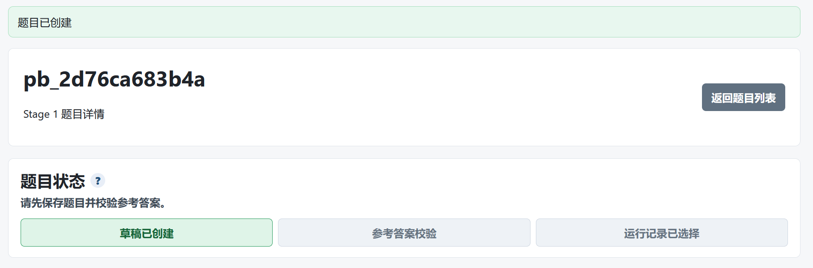

因此，对于首次使用系统的学生，正确流程不是“导入题目包”，而是“新建 5 道题目 → 勾选 5 道题目 → 导出题目包”。导出的题目包可以作为后续修改、备份或提交使用。

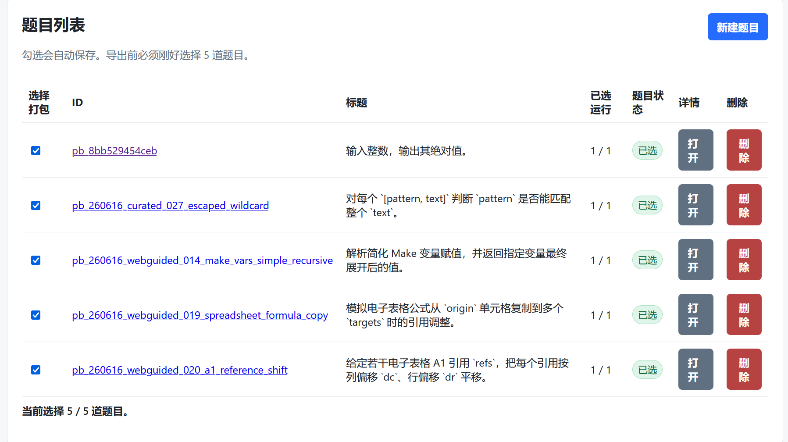

------

## 四、编写自己的编程题目

每道题目建议按照以下结构编写，保证模型和系统都能准确理解并运行测试。

**题目标题**

标题应简短明确，能直接反映题目任务。例如：

```
计算区间内偶数之和
```

**题目描述**

说明程序需要完成什么任务。描述要避免歧义，不要只写一句过于宽泛的话。

示例：

```
给定两个整数 L 和 R，请计算闭区间 [L, R] 内所有偶数的和。
```

**输入格式**

说明输入包含几行、每行是什么数据。

示例：

```
输入一行，包含两个整数 L 和 R。
```

**输出格式**

说明程序需要输出什么内容。

示例：

```
输出一个整数，表示区间 [L, R] 内所有偶数的和。
```

 **数据范围**

写清楚输入规模和边界条件，避免参考答案和模型答案理解不一致。

示例：

```
1 ≤ L ≤ R ≤ 10^6
```

**样例输入与样例输出**

至少准备 1 组样例。样例应能帮助理解题意，但不要只覆盖最简单情况。

示例：

```
样例输入：
1 10

样例输出：
30
```

**参考答案**

参考答案必须能够通过所有测试数据。系统会根据参考答案校验题目是否有效。

**测试用例**

测试用例应包括样例数据和测试数据。`p-0`、`p-1` 属于样例数据，`a-0`、`a-1`、`a-2` 等属于测试数据。测试样例通常用于覆盖边界情况，例如最小值、最大值、特殊输入和容易出错的情况。

------

## 五、执行模型运行

题目编写完成后，在页面的 **“模型”** 区域选择模型。可选模型包括：

```
qwen-coder-turbo
qwen3-coder-flash-2025-07-28
```

阿里云文档说明，Qwen-Coder 是面向代码相关任务的语言模型，可用于代码生成和代码补全。

建议保持我们设置的默认参数：

```
temperature = 0.0
top_p = 1.0
```

然后点击：

```
执行模型运行
```

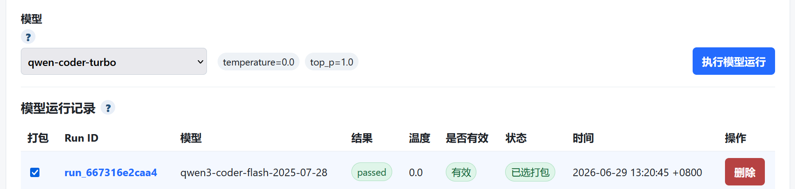

`temperature` 和 `top_p` 都会影响模型输出的多样性。一般来说，数值越低，输出越稳定、越确定；在代码生成、题目评测这类需要稳定结果的场景中，使用较低的 temperature 更合适。

------

## 六、查看模型运行结果

模型运行结束后，系统会在表格中显示运行记录。需要重点查看以下字段：

| 字段     | 说明                              |
| -------- | --------------------------------- |
| Run ID   | 本次模型运行的唯一编号            |
| 模型     | 使用的模型名称                    |
| 结果     | 是否通过测试，理想结果为 `passed` |
| 温度     | 本次运行使用的 temperature        |
| 是否有效 | 是否为有效运行记录                |
| 状态     | 是否已选择打包                    |
| 时间     | 本次运行完成时间                  |

------

## 7 检查选中模型运行详情

点击或查看选中的运行记录后，系统会展示 **“选中模型运行详情”**。需要确认以下信息：

```
Run ID：与上方表格一致
Base URL：模型服务地址
结果：passed
temperature：0.0
top_p：1.0
提示词版本：与系统要求一致
来源：学生自测
模型：与上方表格一致
有效性：有效
```

其中，最重要的是：

```
结果 = passed
有效性 = 有效
```

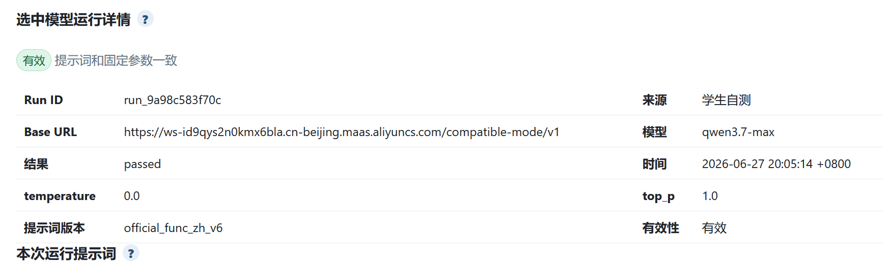

如果结果不是 `passed`，或有效性不是 `有效`，该记录不应作为打包记录使用。

------

## 8 检查模型运行测试结果

继续查看 **“模型运行测试结果”** 表格。每一行代表一个测试用例，需要确认所有用例都通过。

测试结果示例为：

| 用例 ID | 集合     | 结果   | 期望 | 实际/错误 |
| ------- | -------- | ------ | ---- | --------- |
| p-0     | 样例数据 | passed | 1    | 1         |
| p-1     | 样例数据 | passed | 2    | 2         |
| a-0     | 测试数据 | passed | 0    | 0         |
| a-1     | 测试数据 | passed | 3    | 3         |
| a-2     | 测试数据 | passed | 4    | 4         |
| a-3     | 测试数据 | passed | 5    | 5         |
| a-4     | 测试数据 | passed | 6    | 6         |

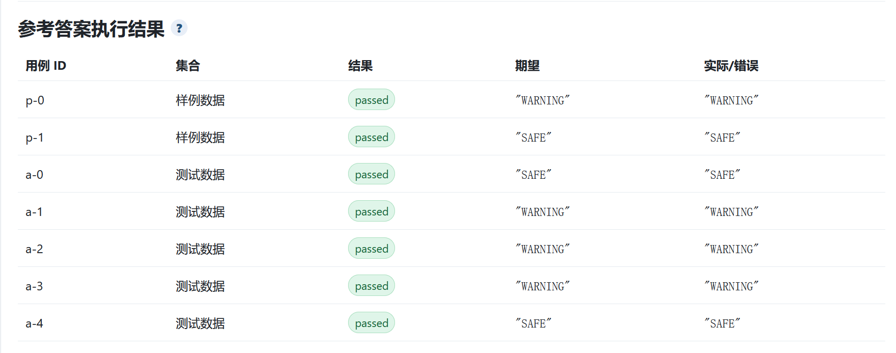

判断标准：

```
所有测试用例结果均为 passed
期望值 与 实际/错误 列一致
没有 failed、error、timeout 等异常状态
```

只有样例数据通过还不够，还需要测试数据也通过。样例通常用于说明题意，额外测试数据则用于检查边界情况和隐藏问题。

------

## 9 选择有效运行记录并打包

完成 5 道题后，应确认页面提示类似：

```
当前选择 5 条；导出包要求每道题选择 1-5 条当前有效的记录。
```

如果某道题没有有效运行记录，或者运行记录没有勾选，导出包可能不符合 Stage 1 要求。


------

## 10 Stage 1 完成标准

提交前逐项检查：

```
√ 已完成 5 道编程题目
√ 每道题都有清晰的题目描述、输入格式、输出格式和数据范围
√ 每道题都有样例输入和样例输出
√ 每道题都有参考答案
√ 每道题的参考答案校验通过
√ 每道题都有样例数据和测试数据
√ 模型运行结果显示 passed
√ 运行记录显示 有效
√ 每道题已选择 1-5 条有效运行记录
√ 状态显示 已选打包
√ 最终导出 Stage 1 原始题目包
```

------

## 11 常见问题处理

**问题 1：保存与校验结果不是 passed**

处理方法：

```
检查题目描述是否有歧义；
检查输入格式和输出格式是否写清楚；
检查样例输出是否正确；
检查参考答案是否正确；
```

**为确保题目本身的正确性，修改后需重新执行保存题目与校验参考答案：**


**问题 2：保存与校验的测试数据中部分用例 failed**

处理方法：

```
查看 failed 用例的期望值和实际输出，检查测试用例的期望结果是否写错；
判断是模型答案错误、参考答案错误，还是测试数据错误；
重点检查边界数据，例如 0、1、最大值、空列表、重复元素、负数等。
```

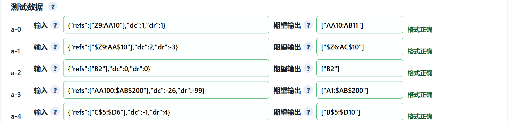

------

# Stage 2：匿名审稿操作说明

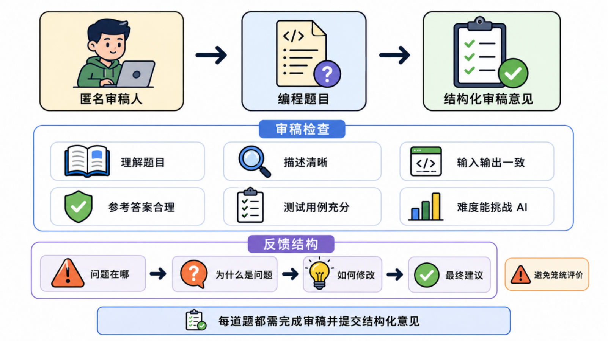

## 一、Stage 2 任务目标

Stage 2 的任务是对分配到的编程题目进行匿名审稿。学生需要导入助教发放的审稿任务包，阅读其他同学设计的编程题目，检查题目质量，并填写结构化 review。审稿目标不是“挑错”或“打低分”，而是帮助出题人发现问题、明确修改方向、提升题目质量。教学中的同行评审通常需要配合清晰的标准、检查表或评分量表，才能让反馈更具体、更可操作。


# 7.1.10新版本速览

| 模块               | 你要完成什么                               | 成功标志                       |
| ------------------ | ------------------------------------------ | ------------------------------ |
| 🔍 升级前检查       | 确认旧版本、容器、镜像、端口和数据挂载位置 | 能明确旧数据目录和容器挂载关系 |
| 🆕 干净数据目录     | 为新版本创建全新的数据目录                 | 新旧版本不共用同一数据目录     |
| 🐳 新版本启动       | 导入新镜像并重新创建容器                   | `docker compose ps` 显示 `Up`  |
| 🧪 升级验收         | 检查页面、日志、版本和核心功能             | 页面可访问，功能无异常         |
| 🕶️ Stage 2 匿名审稿 | 根据包的来源选择正确导入按钮               | 任务包与存档包不会混用         |
| 📦 导入任务包       | 导入教师下发的匿名审稿任务                 | 页面生成新的 Stage 2 审稿任务  |
| 🗄️ 导入存档包       | 恢复此前导出的本地审稿进度                 | 原有审稿状态与内容成功恢复     |


> **升级版本时，需要让新版本挂载到一个全新的、干净的数据目录。**
> 不建议新版本直接继续使用旧版本数据目录。旧数据中可能保留旧版数据库结构、缓存、索引、运行状态或不兼容配置，直接复用可能导致页面异常、任务状态错乱、导入失败或版本行为不一致。
> 要求新建项目目录路径,以确保得到**全新的、干净的数据目录**


# CodeSetArena v7.1.10新系统_Guide 
---

<div style="text-align: center;">
🔄 ━━━━━━ CodeSetArena 系统版本升级 ━━━━━━ 🔄
</div>


# 第一部分：升级前确认

## 1. 进入当前版本目录

以下路径仅为示例，请替换为你实际使用的目录：

```bash
cd /root/workspace/Online/codesetarena-student-local-v7.1.7-linux-amd64
```

检查当前服务：

```bash
docker compose ps
docker compose images
docker compose logs --tail=100
```

建议额外记录：

```bash
docker version
docker compose version
uname -m
```

## 2. 确认当前数据挂载位置 宿主机目录绑定挂载

先查看最终生效的 Compose 配置：

```bash
docker compose config
```

再查看当前容器的挂载关系：

```bash
docker ps --format 'table {{.Names}}\t{{.Image}}\t{{.Status}}\t{{.Ports}}'
```

**执行数据目录查询：**

将 `<CONTAINER_NAME>` 替换为实际容器名：

```bash
docker inspect codesetarena-student-local-v7110-linux-amd64-codesetarena-student-1 \
  --format '{{range .Mounts}}{{println .Type .Source "->" .Destination}}{{end}}'
```

控制台输出结果：

```text
bind /root/workspace/codesetarena-student-local-v7.1.x-linux-amd64/data -> /app/data
```

其中：

- `bind`：表示绑定挂载；
- `/root/workspace/codesetarena-data-v7.1.x`：宿主机数据目录；
- `/app/data`：容器内数据目录。

## 3. 创建新版本目录

示例：

```bash
mkdir -p /root/workspace/Online
cd /root/workspace/Online
```

把新版本发布包复制到该目录并解压：

```bash
NEW_PKG="/mnt/f/Ubuntu/DUT_IR/Codesetarena/codesetarena-student-local-v7.1.10-linux-amd64.tar.gz"

ls -lh "$NEW_PKG"
cp "$NEW_PKG" .
tar -xzf "$(basename "$NEW_PKG")"
```

进入新版本目录：

```bash
cd /root/workspace/Online/codesetarena-student-local-v7.1.10-linux-amd64
ls -lah
```

#### **强调新建目录的目的是为了给新版本创建全新的数据目录**

对当前 CodeSetArena v7.1.10 而言，只要新版本独立解压到自己新创建的目录下，Compose 使用该目录下独立的 `./data:/data`，并且这个 `data` 在首次启动前为空，就已经实现了“新版本使用全新的数据目录”。

---

<div style="text-align: center;">
🆕 ━━━━━━ 新版本使用干净数据目录 ━━━━━━ 🆕
</div>

# 导入新镜像并启动

## 1. 确认架构

```bash
uname -m
```

amd64 环境通常应输出：

```text
x86_64
```

## 2. 导入新版本镜像

先查看发布包中的镜像文件：

```bash
ls -lh *.tar
```

执行：

```bash
docker load -i <NEW_IMAGE_FILE>.image.tar
```

查看镜像：

```bash
docker images
```

## 3. 启动新版本

```bash
docker compose up -d
docker compose ps
```

查看日志：

```bash
docker compose logs --tail=200
```

持续观察：

```bash
docker compose logs -f
```

退出持续日志：

```text
Ctrl + C
```

## 4. 再次确认挂载目录

```bash
docker inspect <NEW_CONTAINER_NAME> \
  --format '{{range .Mounts}}{{println .Type .Source "->" .Destination}}{{end}}'
```

必须确认输出中不再指向旧版本目录。

---

<div style="text-align: center;">
🕶️ ━━━━━━ Stage 2 匿名审稿新增导入方式 ━━━━━━ 🕶️
</div>


# 新增功能说明

学生端 **Stage 2 匿名审稿** 页面新增两种导入入口：

```text
导入任务包
导入存档包
```

两个按钮用途不同，不能混用。

| 按钮           | 用途                                  | 包的典型来源           | 使用时机                             |
| -------------- | ------------------------------------- | ---------------------- | ------------------------------------ |
| **导入任务包** | 创建或载入新的 Stage 2 匿名审稿任务   | 教师端或任务发布方下发 | 第一次领取本轮审稿任务               |
| **导入存档包** | 恢复此前保存的 Stage 2 审稿状态和进度 | 学生端此前导出的存档   | 更换电脑、重装、升级或继续未完成审稿 |

## 一句话判断

```text
老师新发给你的审稿任务 → 导入任务包
你自己此前备份出来的审稿进度 → 导入存档包
```

> [!WARNING]
> 不要因为两个文件都是 `.tar.gz` 就随意选择按钮。  
> 文件扩展名相同，不代表包类型相同。应根据包的来源、用途以及系统页面提示选择正确入口。

# 

---

# 按钮选择错误时的处理

## 情况 1：把任务包选到“导入存档包”

可能出现：

- 包类型不匹配；
- manifest 类型不匹配；
- 缺少存档状态字段；
- 系统提示无效存档包；
- 页面拒绝导入。

处理方法：

```text
返回 Stage 2 匿名审稿页面
→ 选择“导入任务包”
→ 重新选择教师下发的文件
```

## 情况 2：把存档包选到“导入任务包”

可能出现：

- 任务包类型校验失败；
- 重复任务提示；
- payload 结构不符合新任务格式；
- 系统拒绝载入。

处理方法：

```text
返回 Stage 2 匿名审稿页面
→ 选择“导入存档包”
→ 重新选择本人此前导出存档
```

---

# 运维检查命令合集

## 查看容器

```bash
docker ps -a
docker compose ps
```

## 查看镜像

```bash
docker images
docker compose images
```

## 查看挂载

```bash
docker inspect <CONTAINER_NAME> \
  --format '{{range .Mounts}}{{println .Type .Source "->" .Destination}}{{end}}'
```

## 查看 Compose 最终配置

```bash
docker compose config
```

## 查看日志

```bash
docker compose logs --tail=200
docker compose logs -f
```

## 查看数据目录

```bash
ls -lah <DATA_DIR>
du -sh <DATA_DIR>
find <DATA_DIR> -maxdepth 2 -type f | head -n 50
```

## 查看端口

```bash
docker ps --format 'table {{.Names}}\t{{.Ports}}\t{{.Status}}'
```


------

## 二、进入 Stage 2 匿名审稿页面

打开系统后，进入：

```
Stage 2 匿名审稿
```

页面说明为：

```
导入助教发放的审稿任务包，填写结构化 review。
```

本阶段会收到两类内容：

```
1. 助教发放的匿名审稿任务包
2. 其他同学设计的编程题目
```

需要完成的工作包括：

```
1. 导入审稿任务包
2. 对题目进行结构化评审
3. 选择审稿结论
4. 给出题目质量评分
5. 填写清晰、具体、可执行的修改建议
6. 确认所有分配题目均已完成审稿
```

------

## 三、导入审稿任务包

在 **“清空当前 Stage 与导入包”** 区域，可以看到以下按钮：

```
清空当前 Stage
选择文件
导入审稿任务包
```

助教发放的 Stage 2 审稿任务包文件名通常类似：

```
{学号}-teacher-stage2-review-assignment.tar.gz
```

操作步骤如下：

```
1. 点击“选择文件”
2. 选择助教发放的审稿任务包
3. 点击“导入审稿任务包”
4. 等待系统导入完成
5. 检查页面中是否出现分配到的审稿题目
```

页面提示说明：导入后会同步学生信息，并替换当前审稿任务。因此，如果当前页面已有未完成或未导出的审稿内容，导入前应先确认是否需要保留。

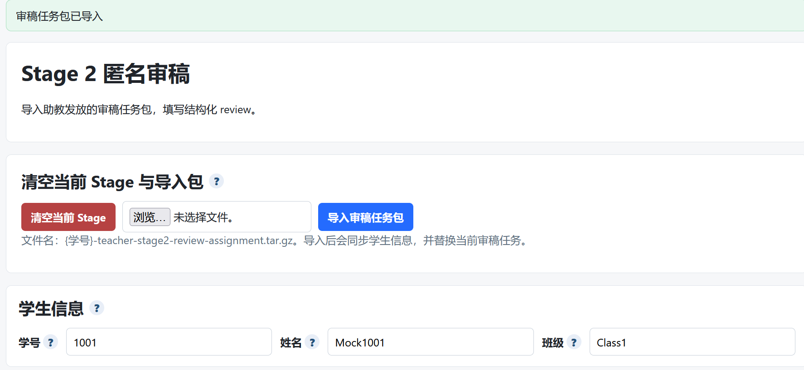

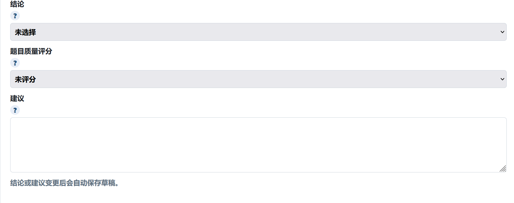

------

## 四、审稿前需要阅读的内容

对每道分配到的题目，至少需要阅读以下内容：

```
1. 题目标题
2. 题目描述
3. 输入格式
4. 输出格式
5. 数据范围
6. 样例输入
7. 样例输出
8. 参考答案或标准解法
9. 测试用例设计
10. 模型运行结果或有效记录
```

审稿时应重点判断题目是否“能被准确理解、能被正确求解、能被测试数据有效区分答案质量”。代码审查和题目审查都应关注设计、功能正确性、复杂度、测试、命名、说明和可维护性等方面，而不是只看表面格式。

------

## 五、审稿检查维度

### 5.1 是否理解题目

检查题目是否能让读者快速明白要解决什么问题。

重点查看：

```
题目背景是否必要且清楚
核心任务是否明确
是否说明要计算、判断、输出或构造什么
是否存在多种理解方式
```

常见问题：

```
题目只描述故事，没有明确任务
题目中出现未定义变量
题目要求和样例不一致
题目没有说明输入数据的含义
```

------

### 5.2 题目描述是否清晰

检查题目语言是否准确、完整、没有歧义。

建议关注：

```
每个变量是否解释清楚
边界情况是否说明
特殊情况是否说明
输出要求是否具体
是否使用了容易误解的表达
```

不建议只写：

```
描述不清楚。
```

建议写成：

```
题目中提到“合法字符串”，但没有定义什么情况下字符串是合法的。建议补充合法字符串的判定规则，例如是否只允许小写字母、是否允许空字符串、是否区分大小写。
```

------

### 5.3 输入输出是否一致

检查输入格式、输出格式、样例和参考答案是否相互一致。

重点查看：

```
输入有几行
每行有几个数或字符串
是否存在多组数据
输出是一个值还是多行结果
样例输出是否能由样例输入推导出来
```

------

### 5.4 参考答案是否合理

检查参考答案是否真正解决了题目，而不是只适用于样例。

重点查看：

```
算法思路是否符合题目要求
是否处理边界数据
是否存在明显复杂度过高的问题
是否与数据范围匹配
是否可能出现溢出、除零、数组越界等问题
```

如果发现参考答案可能有误，应明确指出触发问题的输入场景。

------

### 5.5 测试用例是否充分

测试用例不能只覆盖样例，还应覆盖边界情况、一般情况和容易出错的情况。

建议检查：

```
是否包含最小输入
是否包含最大输入
是否包含普通随机数据
是否包含特殊结构数据
是否包含容易让错误算法通过样例但失败的反例
```

例如，对于区间求和类题目，应至少考虑：

```
L = R 的情况
区间内没有目标元素的情况
区间边界正好满足条件的情况
大范围数据
```

自动评测工具常通过测试用例返回是否通过、期望输出和实际输出等信息，但这类反馈往往只能说明“对错”，未必能覆盖可读性、可维护性和题目质量，因此人工审稿仍然需要检查描述、边界和测试设计。

------

### 5.6 难度是否能挑战 AI

Stage 1 的题目需要被模型运行检验，因此 Stage 2 审稿时也要判断题目难度是否合适。

可以从以下方面判断：

```
题目是否过于简单，几乎只需照抄样例规律
题目是否有明确算法点
题目是否需要处理边界情况
测试数据是否能区分正确算法和错误算法
是否存在多种可能解法
```

不建议把“难度高”理解为“描述复杂”。好的题目应当是描述清楚、要求明确，但需要一定思考才能正确完成。

------

## 六、填写审稿结论

页面中的 **“结论”** 下拉框包含：

```
未选择
accept
minor
major
reject
```

建议按照以下标准选择。

| 结论   | 使用场景                                                     |
| ------ | ------------------------------------------------------------ |
| accept | 题目质量较好，描述清楚，输入输出一致，参考答案合理，测试用例充分，仅有很小的格式或表达问题 |
| minor  | 题目整体可用，但存在少量小问题，例如个别表述不清、样例解释不足、测试用例略少 |
| major  | 题目明显问题，需要较大修改后才能使用，描述有歧义、数据范围缺失、测试用例不足、参考答案可能错误 |
| reject | 题目当前不适合作为有效编程题，核心任务不明确、输入输出矛盾、参考答案错误严重、无法判断正确答案 |

选择结论时，应以“题目是否能帮助提升整体质量”为标准。代码审查实践中也强调，不应追求不存在的“完美”，而应判断作品是否在可接受状态下持续改进；重要问题应阻止通过，轻微问题可以作为建议提出。

------

## 七、填写题目质量评分

页面中的 **“题目质量评分”** 下拉框包含：

```
未评分
5 分
4 分
3 分
2 分
1 分
```

建议评分标准如下：

| 分数 | 评分参考                                                     |
| ---- | ------------------------------------------------------------ |
| 5 分 | 题目完整清晰，输入输出一致，参考答案正确，测试充分，难度合适，几乎不需要修改 |
| 4 分 | 题目整体较好，有少量表达或测试覆盖问题，简单修改后即可使用   |
| 3 分 | 题目基本可理解，但存在较明显问题，例如边界说明不足、测试不充分、部分描述不清 |
| 2 分 | 题目存在严重缺陷，需要大幅修改，例如输入输出不一致、参考答案可疑、核心条件缺失 |
| 1 分 | 题目基本不可用，例如无法理解任务、样例与题意矛盾、没有可靠参考答案或测试 |

评分应与结论保持一致。一般来说：

```
accept 通常对应 4-5 分
minor 通常对应 3-4 分
major 通常对应 2-3 分
reject 通常对应 1-2 分
```

------

## 八、填写结构化建议

建议不要只写一句笼统评价，而应采用结构化格式。有效反馈应具体、解释原因，并让对方知道下一步如何修改；

代码审查意见也建议区分必须修改的问题、建议项和可选项，避免作者误解所有意见都是同等严重。模板如下：

```
【总体评价】
本题的核心任务是……，整体上能够 / 暂时不能作为有效编程题使用。

【主要问题】
1. 问题位置：
   说明具体出现在题目描述、输入格式、输出格式、样例、参考答案或测试用例中的哪一部分。

2. 问题原因：
   说明为什么这是问题，例如会导致歧义、无法判断答案、边界情况不清楚、测试覆盖不足等。

【修改建议】
1. 建议补充……
2. 建议修改……
3. 建议增加测试用例……

【最终建议】
建议本题 accept / minor / major / reject。若按上述建议修改，题目质量可以提升到……分左右。
```

------

## 九、审稿意见示例

**示例 1：minor**

```
结论：minor
题目质量评分：4 分

【总体评价】
本题任务比较清楚，输入输出格式基本完整，样例能够说明题意，参考答案思路也比较合理。

【主要问题】
题目描述中没有明确说明当区间内不存在满足条件的数时应输出什么。虽然样例没有覆盖该情况，但测试数据中可能出现这种边界输入。

【修改建议】
建议在输出格式中补充：“如果不存在满足条件的数，则输出 0。” 同时增加一组测试数据，例如输入区间内没有目标元素的情况，用于检查程序是否正确处理边界。

【最终建议】
建议 minor。补充边界说明和对应测试后，本题可以作为有效题目使用。
```

**示例 2：major**

```tex
结论：major
题目质量评分：2 分

【总体评价】
本题有一定算法意义，但目前题目描述和样例之间存在不一致，需要较大修改后才能使用。

【主要问题】
题目要求输出“最少操作次数”，但样例解释中的计算过程更像是在输出“最多可完成次数”。这会导致读者无法判断真正的优化目标。

【修改建议】
建议重新明确优化目标。如果目标是最少操作次数，需要补充操作定义、终止条件和最优标准；如果目标是最多可完成次数，则应修改题目描述中的关键词，并同步修改输出格式和样例解释。

【最终建议】
建议 major。当前版本不建议直接使用，修改目标定义和样例后再重新审稿。
```

**示例 3：reject**

```
结论：reject
题目质量评分：1 分

【总体评价】
本题当前无法作为有效编程题使用，因为核心任务不明确，且缺少必要的输入输出规则。

【主要问题】
题目只说明“判断字符串是否符合要求”，但没有定义具体要求，也没有给出合法与非法字符串的判定标准。参考答案和测试数据无法被独立验证。

【修改建议】
建议重新设计题目，明确字符串的合法规则，例如字符集、长度范围、必须满足的条件、输出格式和至少 2 组样例。完成这些内容后，再补充覆盖边界情况的测试数据。

【最终建议】
建议 reject。当前版本无法判断正确答案。
```

------

## 十、避免无效审稿意见

不建议填写以下类型的意见：

```
题目还行。
写得不好。
建议改一下。
测试多一点。
我看不懂。
```

这些意见的问题是缺少具体位置、原因和修改方向。

审稿时应评价题目本身，而不是评价出题人。高质量审查意见应保持礼貌、指出问题、解释理由，并尽量给出可操作的修改建议。

------

## 十一、每道题的完成标准

每道分配到的题目都需要完成以下内容：

```
√ 已完整阅读题目
√ 已检查题目描述是否清晰
√ 已检查输入输出是否一致
√ 已检查样例是否正确
√ 已检查参考答案是否合理
√ 已检查测试用例是否充分
√ 已判断难度是否合适
√ 已选择结论：accept / minor / major / reject
√ 已选择题目质量评分：1-5 分
√ 已填写结构化建议
√ 建议内容具体、清晰、可执行
```

------

## 十二、Stage 2 提交前检查清单

**提交前需要确认：**

```
√ 已成功导入助教发放的匿名审稿任务包
√ 所有分配到的题目均已完成审稿
√ 每道题都选择了结论
√ 每道题都填写了题目质量评分
√ 每道题都填写了建议
√ 建议不是空泛评价，而是包含具体问题和修改方向
√ 结论、评分和建议内容一致
√ 没有在建议中写出自己的姓名、学号、班级等个人信息
√ 没有使用攻击性、讽刺性或情绪化表达
√ 已确认系统自动保存草稿或完成最终导出 / 提交
```

### Hints-导出 Stage 2 审稿提交包

完成题目审稿后，学生需要导出 **Stage 2 审稿提交包**。该文件是第二阶段提交材料，不是 Stage 1 原始题目包，二者文件名不同、用途不同，不能混用。

Stage 2 审稿提交包的文件名必须严格符合以下格式：

```
{学号}-student-stage2-reviews.tar.gz
```

其中，`{学号}` 需要替换为学生本人学号。例如学生学号为 `20250001`，则导出的文件名应为：

```
20250001-student-stage2-reviews.tar.gz
```

提交前必须重点检查以下内容：

1. 文件名是否包含本人学号；
2. 文件名中是否为 `student-stage2-reviews`，不能写成 `student-stage1-problems`；
3. 文件扩展名是否为 `.tar.gz`；
4. 是否提交的是系统导出的压缩包，而不是解压后的文件夹；
5. 是否已经完成规定数量题目的审稿内容；
6. 是否误交了 Stage 1 原始题目包。

特别注意：Stage 1 原始题目包文件名通常为：

```
{学号}-student-stage1-problems.tar.gz
```

Stage 2 审稿提交包文件名必须为：

```
{学号}-student-stage2-reviews.tar.gz
```

两者不能互相替代。若提交文件名不符合要求，可能会导致系统或助教无法识别提交内容。因此，导出后应立即检查文件名，确认无误后再提交。

**确认无误后下载审稿包：**

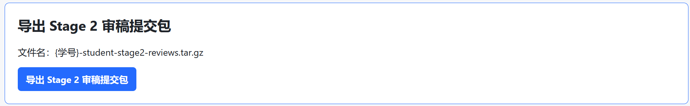

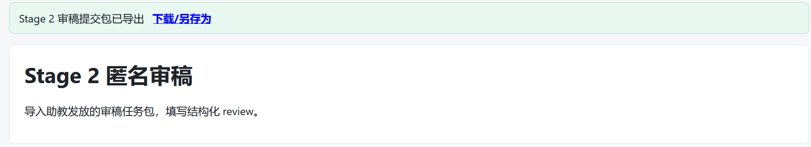

### 3.3 导出 Stage 2 审稿提交包

完成题目审稿后，学生需要导出 **Stage 2 审稿提交包**。该文件是第二阶段提交材料，不是 Stage 1 原始题目包，二者文件名不同、用途不同，不能混用。

Stage 2 审稿提交包的文件名必须严格符合以下格式：

```
{学号}-student-stage2-reviews.tar.gz
```

其中，`{学号}` 需要替换为学生本人学号。例如学生学号为 `20250001`，则导出的文件名应为：

```
20250001-student-stage2-reviews.tar.gz
```

提交前必须重点检查以下内容：

1. 文件名是否包含本人学号；
2. 文件名中是否为 `student-stage2-reviews`，不能写成 `student-stage1-problems`；
3. 文件扩展名是否为 `.tar.gz`；
4. 是否提交的是系统导出的压缩包，而不是解压后的文件夹；
5. 是否已经完成规定数量题目的审稿内容；
6. 是否误交了 Stage 1 原始题目包。

特别注意：Stage 1 原始题目包文件名通常为：

```
{学号}-student-stage1-problems.tar.gz
```

Stage 2 审稿提交包文件名必须为：

```
{学号}-student-stage2-reviews.tar.gz
```

两者不能互相替代。若提交文件名不符合要求，可能会导致系统或助教无法识别提交内容。因此，导出后应立即检查文件名，确认无误后再提交。

------

## 十三、Stage 2 审稿原则总结

Stage 2 的核心是：

```
看懂题目 → 找出问题 → 解释原因 → 给出建议 → 形成结论
```

审稿重点包括：

```
1. 题目是否能被准确理解
2. 描述是否清楚
3. 输入输出是否一致
4. 参考答案是否合理
5. 测试用例是否充分
6. 难度是否合适
7. 反馈是否具体、有效、可执行
```

# Stage 3：修订与提交操作说明

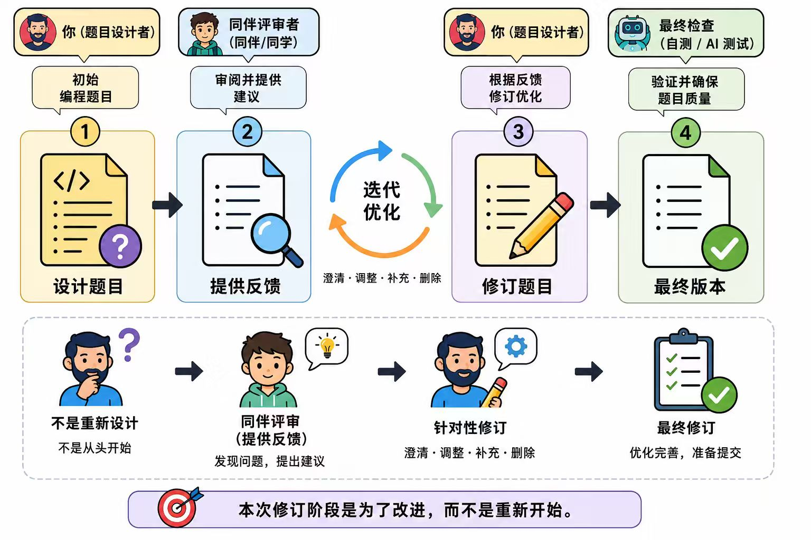

## 一、Stage 3 任务目标

Stage 3 的任务是根据收到的匿名审稿意见，修订自己在 Stage 1 中设计的编程题目，并完成最终提交。学生需要认真阅读同学给出的审稿反馈，判断哪些建议需要采纳、哪些建议可以部分采纳或不采纳，然后修改题目描述、输入输出说明、样例、测试用例和参考答案等内容，最后重新校验、重新执行模型运行，并导出最终修订包。

------

## 二、进入 Stage 3 修订与提交页面

打开系统后，进入：

```text
Stage 3 修订与提交
```

页面说明为：

```text
根据审稿意见修订题目，完成参考答案校验和模型自测后，导出最终修订包。
```

本阶段会收到：

```text
1. 来自同学的匿名审稿意见
2. 针对自己编程题目的修改建议
```

本阶段需要完成：

```text
1. 导入修订反馈包
2. 阅读并理解收到的审稿反馈
3. 判断反馈是否需要采纳
4. 修改题目描述、输入输出说明、样例、测试用例和参考答案
5. 保存题目并校验参考答案
6. 重新执行模型运行
7. 选择有效模型运行记录
8. 对审稿意见的帮助程度进行评分
9. 导出 Stage 3 修订提交包
```

------

## 三、导入修订反馈包

在 **“清空当前 Stage 与导入包”** 区域，可以看到：

```text
清空当前 Stage
选择文件
导入修订反馈包
```

助教发放的 Stage 3 修订反馈包文件名通常类似：

```text
{学号}-teacher-stage3-review-feedback.tar.gz
```

操作步骤如下：

```text
1. 点击“选择文件”
2. 选择助教发放的 Stage 3 修订反馈包
3. 点击“导入修订反馈包”
4. 等待系统导入完成
5. 检查学生信息是否正确
6. 检查页面中是否显示自己的题目和审稿意见
```

导入后会同步学生信息，并替换当前修订反馈。若页面中已有正在修改的内容，导入前应先确认是否已经保存或导出备份。

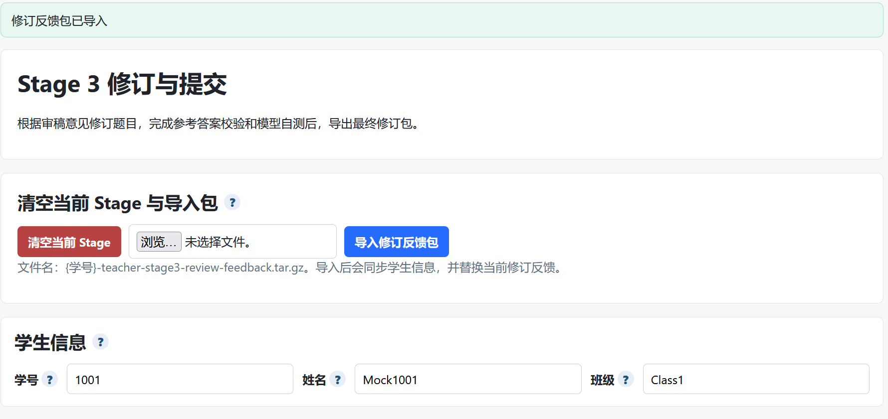

------

## 四、检查学生信息

导入修订反馈包后，查看 **“学生信息”** 区域，确认以下内容正确：

```text
学号
姓名
班级
```

若学生信息与本人不一致，应停止后续操作，重新确认是否导入了正确的反馈包。

------

## 五、阅读题目信息

进入题目编辑区域后，首先阅读 **“题目信息”**。

要求：只要修改了题面、函数签名、参考答案、样例或测试数据，就需要重新保存校验，并重新执行模型运行。不能只修改文字后直接提交。

题目信息通常包含：

```text
1. 题面
2. 函数签名
3. 参考答案
4. 样例数据
5. 测试数据
6. 模型运行记录
7. 审稿意见评分与回应建议
```

------

## 六、根据审稿意见修订题面

题面是模型和评测者理解题目的主要依据，应优先修改。给出示例：

```text
# 半开时间段最大并发

实现 solve(intervals: list[list[int]]) -> int。

每个时间段是半开区间 [start, end)。end == start 的时间段长度为 0，不贡献并发。返回最大同时活跃区间数。
```

修订题面时应检查：

```text
1. 题目目标是否明确
2. 输入参数含义是否清楚
3. 输出结果是否唯一
4. 特殊情况是否说明
5. 边界条件是否覆盖
6. 是否避免歧义表达
```

例如，若审稿意见指出“没有说明 end == start 怎么处理”，就应在题面中补充：

```text
当 end == start 时，该时间段长度为 0，不计入并发。
```

若审稿意见指出“没有说明区间是闭区间还是半开区间”，就应明确写成：

```text
每个时间段均为半开区间 [start, end)，包含 start，不包含 end。
```

这类修改能够让题目更清晰、更可靠。代码审查实践中也强调，审查应关注整体设计、功能正确性、复杂度、测试以及说明是否清楚；如果审稿意见指出理解困难，通常应该把解释写进题目本身，而不是只在备注中解释。

------

## 七、修改函数签名(Solve)

查看 **“函数签名”** 区域。给出函数签名示例：

```python
def solve(intervals: list[list[int]]) -> int:
```

函数签名必须与题面、参考答案、样例输入保持一致。检查时重点确认：

```text
1. 函数名是否为 solve
2. 参数名称是否与题面一致
3. 参数类型是否与样例 JSON 输入一致
4. 返回值类型是否与期望输出一致
```

若题面写的是 `intervals`，样例输入也应使用：

```json
{"intervals":[[1,3],[3,5]]}
```

不要出现题面写 `arr`，样例却使用 `intervals` 的情况。

------

## 八、修改参考答案

查看 **“参考答案”** 区域。参考答案必须能正确处理所有样例数据和测试数据。

参考答案示例为：

```python
def solve(intervals: list[list[int]]) -> int:
    events = []
    for start, end in intervals:
        if start < end:
            events.append((start, 1))
            events.append((end, -1))
    cur = best = 0
    for _, delta in sorted(events, key=lambda x: (x[0], x[1])):
        cur += delta
        best = max(best, cur)
    return best
```

修订参考答案时应重点检查：

```text
1. 是否与题面定义一致
2. 是否处理空输入
3. 是否处理边界数据
4. 是否处理特殊情况
5. 时间复杂度是否适合数据范围
6. 返回值是否与期望输出格式一致
```

例如，对于半开区间 `[start, end)`，如果一个区间在时间 3 结束，另一个区间在时间 3 开始，它们不应算作同时活跃。因此排序事件时，同一时间点应先处理结束事件 `-1`，再处理开始事件 `+1`。

```python
key=lambda x: (x[0], x[1])
```

能够让 `-1` 排在 `+1` 前面，从而正确处理半开区间边界。

------

## 九、修改样例数据

样例数据用于帮助读者理解题意，应覆盖题目的核心规则。给出样例数据为：

```text
p-0
输入：{"intervals":[[1,3],[3,5]]}
期望输出：1
```

样例 `p-0` 说明 `[1,3)` 和 `[3,5)` 在时间点 3 不重叠，因此最大并发为 1。

修订样例时应满足：

```text
1. 样例能体现题目核心规则
2. 样例输入格式与函数签名一致
3. 样例输出能由题意直接推导
4. 样例不要只覆盖最简单情况
5. 样例数量不宜过少
```

------

## 十、修改测试数据

测试数据用于检验参考答案和模型答案是否真正正确。给出测试数据包括：

```text
a-0
输入：{"intervals":[]}
期望输出：0

a-1
输入：{"intervals":[[1,1],[1,2]]}
期望输出：1

a-2
输入：{"intervals":[[1,5],[5,6],[2,5]]}
期望输出：2

a-3
输入：{"intervals":[[0,10],[1,2],[2,3],[3,4]]}
期望输出：2

a-4
输入：{"intervals":[[1,3],[2,4],[3,5]]}
期望输出：2
```

测试数据应覆盖：

```text
1. 空输入
2. 零长度区间
3. 边界相接但不重叠
4. 多个区间同时重叠
5. 开始时间和结束时间相同的边界点
6. 容易让错误算法通过样例但无法通过测试的情况
```

在编程题中，样例测试通常用于说明题意，隐藏条件或边界条件多用于测试AI在不同场景下的能力；可以提供隐藏条件覆盖 corner cases 和多种场景，以验证解法是否真正满足约束。

------

## 十一、保存题目并校验参考答案

完成修改后，进入 **“保存与校验”** 区域，点击：

```text
保存题目并校验参考答案
```

系统会执行参考答案和所有测试用例。

只有当题目无异常且全部测试通过后，才能继续执行模型运行。

检查标准：

```text
1. 页面显示“校验通过”
2. 样例数据全部通过
3. 测试数据全部通过
4. 没有异常、报错或超时
5. 修改后的题面与参考答案一致
```

若校验失败，应先查看失败用例，判断是题面描述、参考答案还是期望输出存在问题，然后修正后重新校验。

------

## 十二、重新执行模型运行

校验通过后，在 **“模型”** 区域选择模型。使用：

```text
qwen-coder-turbo
temperature = 0.0
top_p = 1.0
```

然后点击：

```text
执行模型运行
```

运行完成后，在 **“模型运行记录”** 中检查：

```text
1. 结果是否为 passed
2. 是否有效是否显示“有效”
3. 状态是否显示“已选打包”
4. 左侧“打包”复选框是否已勾选
```

给出示例记录为：

```text
Run ID：run_9329e5d61182
模型：qwen-coder-turbo
结果：passed
温度：0.0
是否有效：有效
状态：已选打包
```

只有 `passed` 且 `有效` 的模型运行记录，才适合作为最终提交包中的有效记录。代码审查的目标不是追求表面通过，而是让整体质量持续提升；对于编程题，模型运行通过只能说明基础行为正确，还需要结合题面、测试和审稿意见确认题目质量。

------

## 十三、查看审稿意见并回应

在 **“审稿意见评分与回应建议”** 区域，可以看到同学给出的匿名审稿意见。

需要完成两件事：

```text
1. 阅读并理解审稿意见
2. 判断该意见对本题修改是否有帮助
```

即使审稿结论是 `accept`，也仍然需要阅读建议内容，判断是否有可改进之处。若意见中指出具体问题，应根据问题修改题目；若意见较笼统，也需要结合自己的判断检查题目是否仍有可优化空间。

------

## 十四、给审稿意见评分

页面中的 **“审稿意见评分”** 下拉框包含：

```text
未评分
5分：对本题改进非常关键
4分：对本题改进很有帮助
3分：对本题改进有一定帮助
2分：帮助有限
1分：基本无帮助
```

建议评分标准如下：

| 分数 | 含义                 | 使用场景                                         |
| ---- | -------------------- | ------------------------------------------------ |
| 5 分 | 对本题改进非常关键   | 指出了严重问题，且该问题直接影响题目能否正确使用 |
| 4 分 | 对本题改进很有帮助   | 指出了清晰、具体的问题，修改后题目质量明显提升   |
| 3 分 | 对本题改进有一定帮助 | 意见有参考价值，但问题不严重或建议不够完整       |
| 2 分 | 帮助有限             | 意见较笼统，只提供了少量可参考信息               |
| 1 分 | 基本无帮助           | 意见空泛、无法执行，或与题目内容关系不大         |

评分重点不是“对方是否给高分”，而是“这条审稿意见是否真正帮助你改进了题目”。评分量表的作用是明确不同等级的评价标准，帮助评价者保持一致，并让出题者理解如何根据反馈修改题目。

------

## 十五、导出最终修订包

所有题目修改完成、参考答案校验通过、模型运行通过、审稿意见评分完成后，导出最终修订包。

页面顶部可能出现提示：

```text
Stage 3 修订提交包已导出
下载/另存为
```

点击：

```text
下载/另存为
```

保存导出的最终修订包。导出包通常用于最终提交，应确认文件保存成功，并按课程要求提交到指定位置。

------

## 十六、Stage 3 完成标准

每道题目都需要满足：

```text
√ 已阅读对应审稿意见
√ 已判断反馈是否采纳、部分采纳或不采纳
√ 已根据反馈修改题目
√ 题面描述更加清晰
√ 输入输出说明与函数签名一致
√ 样例输入和样例输出正确
√ 测试数据覆盖关键边界情况
√ 参考答案与题意一致
√ 页面显示“校验通过”
√ 模型运行结果为 passed
√ 模型运行记录显示“有效”
√ 模型运行记录状态为“已选打包”
```

------

## 十七、提交前检查清单

最终提交前，请逐项确认：

```text
1. 是否导入了正确的 Stage 3 修订反馈包
2. 学号、姓名、班级是否正确
3. 是否完成所有题目的修订
4. 是否认真回应收到的审稿意见
5. 是否明确说明采纳、部分采纳或未采纳的原因
6. 是否修改了题目描述中的歧义内容
7. 是否补充了必要的数据范围和边界说明
8. 是否修改了错误或不充分的样例
9. 是否增加了必要的测试用例
10. 是否重新校验参考答案并通过
11. 是否重新执行模型运行并通过
12. 是否选择了有效运行记录进行打包
13. 是否完成审稿意见评分
14. 是否成功导出最终修订包
```

**确认无误后下载审稿包：**

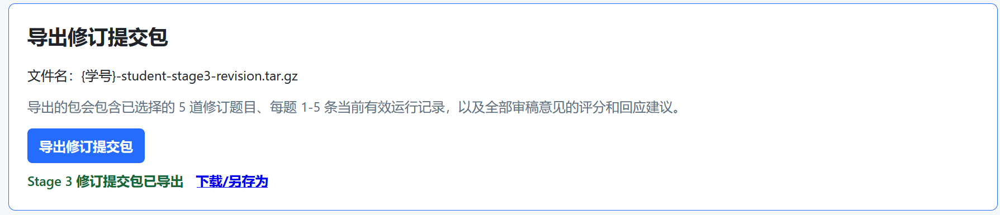

------

## 十八、Stage 3 修订原则总结

Stage 3 的核心流程是：

```text
阅读反馈 → 判断是否采纳 → 修改题目 → 校验参考答案 → 模型自测 → 评价反馈 → 导出提交
```

修订重点包括：

```text
1. 是否认真回应收到的审稿意见
2. 是否根据反馈对题目进行了有效改进
3. 修订后的题目是否更加清晰、完整、可靠
4. 修订是否提升了编程题目的整体质量
5. 是否完成最终校验、模型运行和提交包导出
```
